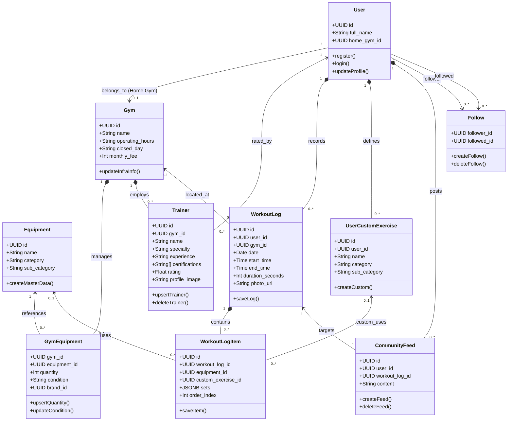
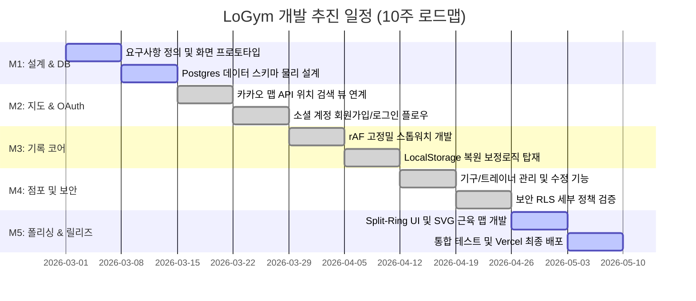

# [LoGym] 사용자 참여형 장소 기반 운동 관리 시스템 개발 계획서
> **과목명**: 소프트웨어공학  
> **제출일**: 2026년 05월 18일  
> **작성자**: 강민제  

---

## 1. 프로젝트 개요

### 1.1 프로젝트명 및 목표
* **프로젝트명**: LoGym (사용자 참여형 장소 기반 운동 관리 시스템)
* **목표**: 
  피트니스 시설 인프라 정보의 불투명성을 해소하여 소비자의 탐색 비용을 절감하고, 실시간 운동 세션 측정 및 세트별 무게/횟수 관리의 편의성을 극대화한다. 나아가 오프라인 피트니스 거점과 소셜 커뮤니티(오운완 피드)를 결합하여 지속 가능한 운동 동기를 부여하고 데이터 기반의 투명한 피트니스 생태계를 구축하는 것을 목표로 한다.

### 1.2 프로젝트 주요기능
1. **위치 서비스**: Kakao Map SDK 기반 실시간 지도 탐색을 통해 주변 헬스장 인프라 정보 제공 및 사용자의 홈 짐(Home Gym) 등록 및 매칭.
2. **참여형 정보 제보**: 헬스장 소속 기구 정보(브랜드명, 상태 등)의 신규 제보 및 수정 오류 제보 프로세스 구축.
3. **점포 상세 관리**: 점포 관리자(Admin) 전용 관리자 대시보드를 제공하여 기구 추가/수정/삭제, 트레이너의 경력 및 자격증 관리(Cloudinary 업로드 지원), 점포 영업 정보 업데이트 기능 지원.
4. **실시간 고정밀 스톱워치**: 1/100초 단위 고정밀 타이머 기능 및 브라우저 강제 종료 시 백그라운드 시간차를 자동 연산하여 메우는 LocalStorage 기반 세션 영속성 보완.
5. **목표 달성 시각화**: Split-Ring 게이지 형태의 대시보드를 통해 일일 운동 목표 대비 달성률을 직관적으로 확인.
6. **소셜 인터랙션**: 오운완 인증 이미지 및 텍스트 기반 피드 작성, 팔로우 기반 관계 맺기, Supabase RLS 보안 정책이 적용된 안전한 댓글 및 알림 시스템 제공.

---

## 2. 프로젝트 기획 배경

### 2.1 프로젝트 배경 및 필요성
피트니스 산업의 비약적인 성장과 더불어 '오늘 운동 완료(오운완)'로 대변되는 소셜 미디어 기반 인증 문화가 주류로 자리 잡았다. 그러나 소비자가 새로운 운동 공간(헬스장)을 선택할 때, 본인이 선호하는 특정 운동 기구의 유무, 브랜드(기구의 성능 및 퀄리티), 혹은 현재 고장 및 수리 상태와 같은 정밀한 인프라 정보는 웹상에서 쉽게 찾을 수 없어 높은 탐색 비용(블로그 후기 검색, 직접 방문 문의 등)이 발생하는 '정보의 비대칭성' 문제가 존재한다.

### 2.2 핵심 가치
1. **투명성(Transparency)**: 집단지성 제보 시스템과 관리자 교차 검증을 통해 신뢰할 수 있는 시설 정보의 투명성 확보.
2. **영속성(Persistence)**: 네트워크 유실이나 디바이스 재시작 상황에서도 연속성을 잃지 않는 고정밀 운동 세션 트래킹.
3. **공유성(Social Interaction)**: 소셜 피드 내 활발한 지지 체계(좋아요, 댓글, 팔로우)를 통한 지속적인 운동 재미 선사.

### 2.3 기대효과
* **사용자 측면**: 자신이 선호하는 최적의 운동 환경을 사전에 탐색하여 헛걸음을 방지하고, 직관적인 대시보드와 정확한 휴식 시간 타이머를 활용해 운동 효율 극대화.
* **시설 관리자 측면**: 고사양 기구 라인업과 검증된 트레이너 프로필을 정직하고 투명하게 대중에 노출함으로써, 합리적인 조건의 신규 회원을 자연스럽게 유입시키는 마케팅 허브 채널 확보.

---

## 3. 프로젝트 개발 계획

### 3.1 프로젝트 개발 프로세스 모델
본 프로젝트는 **애자일 스크럼(Agile Scrum) 모델**을 채택하여 개발을 수행한다.

```
[2주 단위 스프린트 시작] ──> [스프린트 백로그 정의] ──> [일일 스크럼 미팅] ──> [점진적 고도화 및 릴리즈]
```

* **채택 사유**:
  1. **요구사항의 기민한 변화 대응**: 3D 인체 모델링(Three.js) 기술 적용 검토 과정에서의 GPU 성능 이슈 분석 및 SVG 전환과 같은 아키텍처 의사결정 변화를 민첩하게 수용할 수 있다.
  2. **점진적 릴리즈**: 2주 단위 스프린트를 통해 "인증 인프라 -> 지도 탐색 -> 스톱워치 코어 -> 점포 관리자 대시보드 -> 소셜 피드" 순서로 동작 가능한 최소 기능 단위(MVP)를 점진적으로 릴리즈하여 리스크를 상시 완화할 수 있다.

### 3.2 프로젝트 UML (클래스 다이어그램)
각 시스템 엔티티의 속성, 행위 및 관계(1:N, N:M)를 표현한 상세 소프트웨어 클래스 다이어그램은 다음과 같다.



### 3.3 HW / SW 구조 (시스템 구성도)
LoGym은 별도의 백엔드 가상 인프라 운영 부담을 줄이기 위하여 서버리스 BaaS(Backend-as-a-Service) 아키텍처 모델을 채택하였다.

```
[Client Layer]                      [API Gateway / Auth]              [Backend BaaS / Storage Layer]
+-------------------------------+   HTTPS Request / Realtime Socket   +------------------------------------+
|  Web Browser / PWA Sandbox    | ==================================> |          Supabase Engine           |
|                               |                                     |  - GoTrue Auth (Google / Kakao)    |
|  - React Engine (SPA Router)  |                                     |  - Postgres Relational DB          |
|  - Tailwind CSS Styling       |                                     |  - Row Level Security (RLS)        |
|  - Kakao Map Layer (JS SDK)   | <================================== |  - Realtime Database Listener      |
|  - LocalStorage (Stopwatch)   |     Auth Session / Realtime DB      +------------------------------------+
+-------------------------------+                                                      ||
                                                                                       || External CDN
[Continuous Integration / Deploy]                                                     \/
+-------------------------------+                                     +------------------------------------+
|       Vercel CD Pipeline      |                                     |          Cloudinary CDN            |
|  - Automatic Deployment       |                                     |  - Raw Media Optimization          |
|  - Edge Network CDN Cache     |                                     |  - High Performance Image Storage  |
+-------------------------------+                                     +------------------------------------+
```

* **CDN (Contents Delivery Network) 도입**:
  Cloudinary CDN 연동을 통해 사용자가 업로드한 고용량의 '오운완' 인증 이미지와 트레이너 프로필 사진 데이터를 클라우드 상에서 실시간 압축 및 WebP 포맷 최적화를 진행하며, 최적의 지리적 엣지 서버(Edge Server)를 거쳐 사용자 브라우저에 배포된다. 이를 통해 헬스장 상세 페이지의 로딩 속도를 최대 3배 이상 개선하고, 프론트엔드 호스팅 인프라의 스토리지 전송 트래픽을 비약적으로 보존한다.
* **CI/CD 파이프라인**:
  Vercel 플랫폼과의 연동을 주축으로 GitHub 리포지토리의 `main` 브랜치에 코드가 푸시될 때마다 정적 빌드 검증 및 린팅(Linting)이 자동으로 구동되며, 테스트 패스 시점 즉시 엣지 리전(Edge Region)에 중단 없이(Zero-downtime) 서비스 패치가 상시 배포(Continuous Deployment)된다.

---

## 4. 추진 일정

### 4.1 주요 마일스톤
* **M1 (1~2주차) - 설계 및 스키마 확립**: 요구사항 구체화, 피드백 피그마 프로토타입 작성, Supabase 데이터베이스 물리 스키마 정의 및 RLS 기초 토대 마련.
* **M2 (3~4주차) - 지도 탐색 및 계정 결합**: 카카오 맵 API 화면 연계, 유저 소셜 로그인(Kakao/Google OAuth) 구축 및 온보딩 회원가입 플로우.
* **M3 (5~6주차) - 스톱워치 코어 및 PWA 구축**: 고정밀 타이머 시스템 구현, LocalStorage 복원 알고리즘 보완, PWA Manifest 및 오프라인 정적 파일 캐싱 가이드 확립.
* **M4 (7~8주차) - 점포 관리 대시보드 및 보안 안정화**: 시설 내 기구 및 트레이너 정보 추가/수정(Pencil) 기능 및 Cloudinary 이미지 업로드 연동, Supabase RLS 테이블 타겟 권한 세분화 정책 완료.
* **M5 (9~10주차) - UI/UX 폴리싱 및 배포**: Split-Ring 일일 게이지 보완, SVG 기반 근육 맵 렌더링 최적화, Vercel Production 실서비스 런칭.

### 4.2 개발 일정 (간트 차트)


### 4.3 역할 분배
* **PM / 기획**: 
  요구사항 정의, 스프린트 관리 및 마일스톤 추적, 피그마(Figma) 프로토타이핑 설계, 검증 시나리오 작성.
* **프론트엔드 엔지니어(FE)**: 
  React 컴포넌트 개발, PWA Service Worker 및 오프라인 캐싱 캐리어 설계, Kakao Map SDK 연동, `requestAnimationFrame` 활용 스톱워치 훅 설계 및 LocalStorage 예외처리 연동, UI/UX 고도화.
* **백엔드 / 보안 엔지니어(BE)**: 
  Supabase Postgres DB 스키마 모델링, SQL 마이그레이션 관리, 테이블 단위 Row Level Security(RLS) 정책 최적화 설계, Cloudinary 서버리스 파일 가동 인터페이스 구성.

---

## 5. 개발 환경 및 고려사항

### 5.1 개발환경
* **디바이스 OS**: macOS / Windows
* **런타임 및 빌드**: Node.js v18+, Vite
* **프레임워크 및 프론트 기술**: React v18+, Tailwind CSS, Lucide React
* **백엔드 BaaS**: Supabase Client (v2.x)
* **저장 영역**: 브라우저 Web Storage API (LocalStorage), Cloudinary Storage (Image Hosting)
* **배포 및 CI/CD 플랫폼**: Vercel

### 5.2 개발 간 고려사항 및 위험관리

#### [위험 요소 1] Supabase RLS 보안 권한 설정 오류
* **내용**: RLS(Row Level Security) 미설정 시 악의적인 사용자가 API 요청 변조를 통해 다른 회원의 운동 정보를 훼손하거나 개인 신상 정보를 추출하는 위협.
* **대책**: 모든 데이터 테이블에 `ENABLE ROW LEVEL SECURITY`를 명시적으로 적용하며, `auth.uid() = user_id` 조건의 검증 정책을 철저하게 분리 수립하고 지속적으로 권한을 격리하여 보호 테스트 진행.

#### [위험 요소 2] 모바일 디바이스 앱 강제 종료로 인한 운동 시간 기록 유실
* **내용**: 백그라운드 멀티태스킹이나 메모리 부족 상황에서 스마트폰 OS에 의해 앱이 갑작스럽게 킬(Kill)당할 때 현재까지 기록되던 1시간 이상 분량의 스톱워치 기록이 유실되는 위협.
* **대책**: `rAF` 루프 내에서 +1 증가 방식 대신 `Date.now()` 편차 연산을 활용하여 타이머 상태를 보정하며, 상태 변화가 일어날 때마다 `lastStartTime` 타임스탬프 값을 로컬 기기의 LocalStorage에 동기화. 복귀 시점의 시간과 마지막 기록 시점의 시간 간격을 자동으로 산출하여 유실 구간 없이 온전히 복구 가능하게 구현.

#### [위험 요소 3] 인체 3D 히트맵 모델링 연동 시 저사양 폰에서의 성능 저하 및 로딩 속도 장애
* **내용**: 사용자의 부위별 운동 빈도를 시각화하기 위해 3D 그래픽 라이브러리(Three.js)를 구동할 경우, 모바일 기기의 고부하 GPU 연산 점유와 수 MB 이상의 glb 3D 모델 다운로드로 인한 로드 속도 저하(사용자 이탈) 위협.
* **대책**: Three.js 3D 방식과 SVG 2D 백터 조작 방식의 공학적 성능 검증을 거친 후, **SVG 방식을 통해 가벼운 CPU/GPU 연산 구조로 최종 아키텍처 결정.**

##### 📊 시각화 방식 기술적 검증 결과 및 분석
1. **Three.js 방식 (3D)**:
   * *장점*: 3D 입체 카메라 회전으로 사용자에게 역동적인 피드백 선사.
   * *단점*: 3D 라이브러리 로드(약 500KB) + 인체 3D 모델 glb 파일(약 2MB)의 큰 초기 다운로드 용량으로 인하여 **최대 2초 이상의 첫화면 진입 지연 발생**. 구형 모바일 디바이스에서 프레임 드랍(FPS 저하) 및 배터리 전력 소모 가중 우려.
2. **SVG 방식 (2D Vector)**:
   * *장점*: 2D 인체 실루엣을 부위별 XML `<path>` 데이터로 관리하여 **수십 KB 수준의 가벼운 용량 보존**. CSS `transition` 및 HSL 컬러 코드 채우기(`fill`)만을 활용하므로 모바일 기기에서의 **런타임 오버헤드가 사실상 0%에 수렴**.
   * *단점*: 입체적인 회전 조작이 불가능함.
3. **최종 설계 결정**:
   PWA의 궁극적인 목적인 '가벼운 성능과 오프라인 접근성 보장'을 위해, 오버헤드가 극도로 적으며 100% 즉시 렌더링이 가능한 **SVG Path 필터 기법**을 활용하여 신뢰도와 속도를 동시에 충족하는 인체 히트맵 구조를 설계 완료함.
###### 1. Three.js 방식 (3D)의 모바일 한계 검증 (출시 8년 전 기기 기준 - 2018년 전후 디바이스)
* **대상 기기 스펙 (2018년 평균)**: Samsung Galaxy S9 (Snapdragon 845 / Exynos 9810, RAM 4GB), Galaxy A8 2018 (Exynos 7885, RAM 3GB), iPhone 8/X (A11 Bionic, RAM 2GB/3GB).
* **기술적 한계 및 무리성 검증**:
  1. **메모리(RAM) 오버헤드와 OOM (Out Of Memory) 발생**: 3D 인간 모델링 파일(`.glb`, `.gltf`)은 압축 파일 기준으로는 약 2MB 수준이지만, 브라우저가 이를 파싱하여 GPU 메모리에 로드(텍스처 압축 해제, 정점 데이터 로드)할 때 **실제 점유 메모리는 30MB~50MB 이상으로 급증**한다. 2~3GB RAM을 탑재한 구형 기기에서는 OS 가용 메모리가 극도로 제한되어 모바일 브라우저(또는 인앱 브라우저 WebView)의 **메모리 한도(통상 300MB 이하)를 초과하여 브라우저 탭 크래시(OOM)**가 빈번히 일어난다.
  2. **써멀 스로틀링(Thermal Throttling)과 배터리 광탈**: 8년 전 구형 모바일 AP(Mali-G72, Adreno 630 등)는 WebGL을 통해 초당 60프레임을 유지하기 위해 CPU/GPU를 풀 가동한다. 헬스장에서 운동 중 켜놓는 특성상, **단 5분만의 구동으로 칩셋의 온도가 급격히 상승하여 써멀 스로틀링(기기 보호를 위한 강제 클럭 제한)이 작동**하게 되며, 이는 화면 프레임이 10~15FPS 수준으로 뚝 떨어지는 심각한 버벅임과 극심한 배터리 소모를 유발한다.
  3. **자바스크립트 엔진 단일 스레드 병목**: 2018년식 AP의 단일 코어 성능(Cortex-A53/A73)은 최신 디바이스의 30% 이하 수준이다. Three.js 자체의 매트릭스 연산, 바운딩 박스 계산 및 애니메이션 루프 처리가 자바스크립트 메인 스레드를 완전히 독점하게 된다. 이는 사용자가 운동 기록 중 **스톱워치 탭을 터치하거나 기록 입력을 하려 할 때 극심한 입력 지연(Input Latency) 및 터치 먹통 현상**을 발생시킨다.
  4. **초기 Time-to-Interactive (TTI) 지연**: Three.js 코어 라이브러리(약 500KB) + R3F(react-three-fiber, 약 150KB) + 3D 모델(2MB) 등 총 2.6MB 이상의 리소스가 초기 네트워크 탭을 점유하여, LTE 환경에서 **첫 화면 렌더링에 최소 3~5초 이상의 지연**을 유발한다.

###### 2. SVG 방식 (2D Vector)의 우수성 검증
* **성능 지표**:
  1. **메모리 점유**: XML Path 객체 몇 개로만 렌더링되므로 메모리 오버헤드가 **수십 KB**에 불과함.
  2. **연산 부하**: GPU 파이프라인의 3D 연산(쉐이더, 광원, 메시 로딩)이 전혀 필요 없고, 브라우저의 네이티브 2D 하드웨어 가속만을 사용하므로 **구형 디바이스에서도 런타임 CPU/GPU 점유율이 1% 미만으로 수렴**. 써멀 스로틀링이나 배터리 이슈가 원천적으로 배제됨.
  3. **네트워크 효율성**: 라이브러리 파일이 일절 필요 없으며, SVG 코드가 컴포넌트 내부에 빌드되므로 **네트워크 데이터 소모량과 초기 로딩 시간이 사실상 0초에 수렴**.

###### 3. 최종 설계 결정
PWA의 궁극적인 목적인 '가벼운 성능과 오프라인 접근성 보장'을 위해, 그리고 **8년 전 보급형 스마트폰 사용자까지 아우르는 범용적 사용성을 확보**하기 위해, 오버헤드가 극도로 적으며 100% 즉시 렌더링이 가능한 **SVG Path 필터 기법**을 활용하여 신뢰도와 속도를 동시에 충족하는 인체 히트맵 구조를 설계 완료함.
