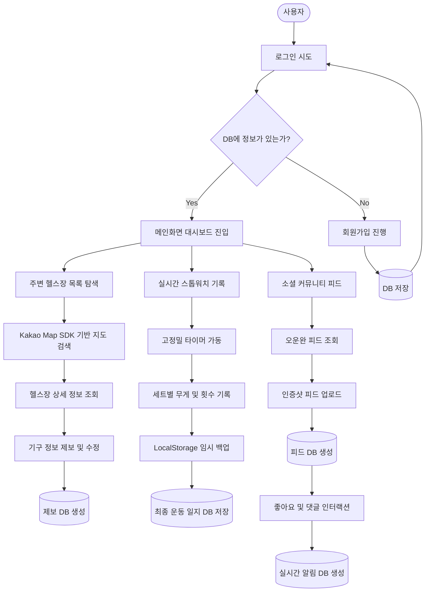
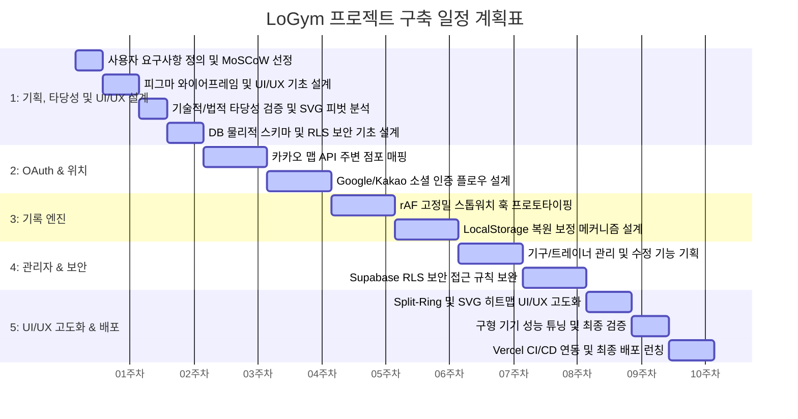

# [LoGym] 사용자 참여형 장소 기반 운동 관리 시스템 개발 계획서 (제안 단계)
> **과목명**: 소프트웨어공학  
> **제출일**: 2026년 05월 18일  
> **작성자**: 강민제  

---

## 1. 프로젝트 개요

### 1.1 프로젝트명 및 목표
* **프로젝트명**: LoGym (사용자 참여형 장소 기반 운동 관리 시스템)
* **목표**: 
  본 프로젝트는 피트니스 센터의 기구 브랜드, 수량, 관리 상태 등 정밀 인프라 정보가 공개되지 않는 '정보의 비대칭성'을 해결하고, 실제 운동 장소의 인프라 정보와 사용자의 운동 기록 데이터를 유기적으로 결합하여 새로운 가치를 창출하는 것을 목표로 한다. 
  집단지성 기반의 제보 및 검증 시스템을 통해 신뢰할 수 있는 헬스장 인프라 지도를 구축하고, 예기치 못한 모바일 백그라운드 전환이나 앱 종료 시에도 세션 데이터 유실을 방지하는 타이머 보전식 고정밀 스톱워치와 Split-Ring 게이지 기반 대시보드를 제공하여 사용자의 정밀한 기록과 체계적인 성장을 지원하고자 한다. 
  최종적으로는 지도 데이터와 개인 기록 데이터를 팔로우 기반 소셜 피드로 연계하여, 운동의 지속성을 극대화하고 소셜 지지를 나누는 피트니스 소셜 허브로의 성장을 지향한다.

### 1.2 프로젝트 주요기능 (구현 예정 항목)
1. **Kakao Map SDK 기반 주변 헬스장 탐색**: 사용자의 현재 위치 또는 지정 지역의 피트니스 센터 위치를 지도 상에 매핑하고, 헬스장 이름 등의 기본 마스터 정보와 함께 해당 시설이 보유한 구체적 기구 인프라 및 관리 상태 정보를 오버레이하여 사용자가 즉각적으로 확인 및 선택할 수 있도록 돕는 **위치 기반 탐색 화면 설계**.
2. **사용자 참여형 기구 정보 제보 시스템**: 헬스장의 기구 인프라 데이터를 관리자가 단독으로 수집하는 한계를 탈피하고, 실제 해당 시설을 이용하는 사용자들이 직접 보유 기구 이름, 수량, 대수, 작동 상태 등을 직접 입력하여 신규 제보하거나 오정보를 수정 제안할 수 있도록 돕는 **이용객 집단지성 기반 참여형 제보 인터페이스 설계**.
3. **점포별 실시간 인프라 데이터 업데이트**: 기구의 신규 입고 또는 고장/수리 상황 등의 최신 변동 정보를 Supabase Realtime Listener(실시간 리스너) 기술을 적용하여 별도의 수동 화면 새로고침 없이 사용자 화면에 즉시 동기화하도록 유도하여 사용자의 헛걸음을 방지하는 **실시간 인프라 동적 업데이트 시스템 구축 계획**.
4. **Split-Ring 게이지 기반 목표 시각화 대시보드**: 사용자가 미리 정의한 당일 운동 목표 세트 수 및 누적 운동 시간 대비 현재의 세션 진행률을 Split-Ring(분할 링) 형태의 인터랙티브 게이지 UI로 렌더링하여, 복잡한 텍스트 데이터 대신 직관적인 그래픽 피드백을 통해 성장을 한눈에 체감하게 돕는 **목표 달성율 시각화 대시보드 기획**.
5. **실시간 고정밀 스톱워치 및 다중 운동 세션 기록**: 1/100초 단위를 정밀하게 반영하기 위해 단순 +1 가산 타이머가 아닌 시작 버튼을 누른 절대 타임스탬프를 기록한 후 현재 시간과의 상대 차를 계산 출력하는 고정밀 타이머 엔진 설계. 동작 중인 타이머 값은 `LocalStorage`에 실시간 보존하고 세션 종료 시 DB로 일괄 저장 후 스토리지를 지워 데이터 유실을 완벽히 차단하는 **세션 데이터 영속화 기록 엔진 구축 계획**.
6. **팔로우 기반 소셜 피드 및 실시간 알림**: '오운완(오늘 운동 완료)' 인증샷과 기록 로그를 피드 형태로 작성해 공유하고, 사용자 간 팔로우 관계를 맺어 게시글에 좋아요와 댓글 반응을 전송하는 소셜 피드 기획. Supabase RLS 보안 정책을 설계하여 친구 관계인 사용자 그룹 간에만 운동 기록 데이터를 안전하게 공유 및 조회하도록 **소셜 인터랙션 보안 설계 예정**.

### 1.3 기능 우선순위 선정 (MoSCoW)
본 프로젝트는 10주간의 한정된 일정과 1인 풀스택 개발 환경이라는 제약 하에, 시스템의 안정성과 완결성을 확보하기 위해 요구사항의 중요도와 구현 긴급성을 기준으로 **MoSCoW 기법**을 적용하여 기능 우선순위를 다음과 같이 정의한다.

1. **Must Have (필수 구현 기능 - 미구현 시 프로젝트 추진 불가)**
   * **Kakao Map SDK 기반 지도 검색**: 사용자의 현재 위치 또는 특정 지역 주변의 헬스장 위치 오버레이 마커 맵 탐색.
   * **고정밀 스톱워치 엔진**: 1/100초 단위를 반영하기 위해 절대 타임스탬프 계산식을 적용한 실시간 타이머 가동 및 세트별 기록 기능.
   * **LocalStorage 이중 백업**: 모바일 백그라운드 전환, 전화 수신, 메모리 부족으로 인한 웹 앱 강제 종료 시 세션 상태 유실을 방지하는 로컬 복원 캐시 엔진.
   * **보안 기초 및 사용자 인증**: 이메일 OTP(6자리 일회용 핀코드) 인증 및 Google/Kakao 소셜 간편 로그인/회원가입 플로우.

2. **Should Have (중요 기능 - 핵심 가치를 위해 강하게 요구되는 기능)**
   * **참여형 정보 제보 시스템**: 헬스장의 보유 기구 이름, 수량, 관리 상태 등을 집단지성으로 제보 및 수정 오류 접수하는 동적 컴포넌트.
   * **점포 어드민 대시보드**: 점주 회원이 직접 기구 현황을 추가/수정/삭제하고, 소속 트레이너의 자격증 이미지(Cloudinary 연동)를 업로드 및 관리하는 승인 대시보드.
   * **Supabase RLS(Row Level Security) 정책**: 다른 사용자의 세션 정보나 기구 제보 데이터를 악의적으로 조작할 수 없도록 차단하는 데이터 행 보안 규칙.
   * **Split-Ring 목표 시각화**: 당일 운동 목표 세트수 대비 달성율을 한눈에 체감하게 돕는 링 모양의 진척도 게이지 대시보드.

3. **Could Have (보조 기능 - 일정 여유 시 구현 예정인 편의/소셜 기능)**
   * **오운완 인증 피드**: 오늘 완료한 운동 로그와 현장 인증 사진을 첨부하여 업로드하는 소셜 타임라인 피드.
   * **통합 알림 및 소셜 인터랙션**: 피드 게시글 반응(좋아요, 댓글) 및 기구 제보 접수를 포괄하는 Supabase Realtime 기반 통합 알림 서랍. (참고: 알림 UI 구현 전이라도 관리자 제보는 DB 로그 형태로 우선 구현하여 주요 기능 우선순위 충돌 방지)

4. **Won't Have (제외 기능 - 리소스 부족 및 기술적 제약으로 이번 차수 제외)**
   * **Three.js 기반 3D 인체 모델 시각화**: 모바일 브라우저의 GPU 연산 과부하 및 1인 개발 공수 오버헤드로 인해 2D SVG로 전면 피벗하여 배제.
   * **주민등록번호 기반 실명 본인인증**: 법적 개인정보 오남용 방지 및 보안 취약점 해소를 위해 사업자등록증 검증으로 대체 및 배제.

---

## 2. 프로젝트 기획 배경

### 2.1 프로젝트 배경 및 필요성
최근 건강 관리 및 근력 운동에 대한 대중적 관심이 급증하며 SNS 상에서 당일의 운동 수행을 인증하는 '오운완(오늘 운동 완료)' 문화가 견고한 트렌드로 자리 잡았다. 
그러나 소비자가 신규 헬스장을 등록하거나 일일권을 끊고 방문하려 할 때, 해당 시설이 자신이 선호하는 고품질 운동 기구 브랜드(예: Hammer Strength, Life Fitness 등)를 갖췄는지, 혹은 타겟 부위의 기구 수량이 충분하고 고장 없이 정상 작동 중인지를 사전에 확인할 수 있는 공인된 수단이 전무하다. 대다수의 소비자들은 네이버 블로그의 불분명한 사진이나 오래된 후기에 의존하는 '정보의 비대칭성'을 겪고 있으며, 이는 헬스장 방문 실패 및 불필요한 탐색 비용을 야기한다. 
LoGym 프로젝트는 이러한 정보 비대칭성을 극복하고, 신뢰할 수 있는 장소 기반 인프라 지도를 제공함과 동시에, 개인의 실재 수행 데이터를 엄밀하게 추적하고 이를 소셜 상에서 건강하게 결합 및 공유하여 지속 가능한 운동 라이프스타일을 지원하고자 시작되었다.

### 2.2 핵심 가치
1. **투명한 정보 제공(Information Transparency) - 탐색 시간 절감**: 불투명하고 단절되어 있던 피트니스 센터의 정밀 인프라(기구 라인업, 브랜드, 대수, 작동 상태) 정보를 집단지성 기반으로 투명하게 공개하여 사용자가 본인 목적에 맞는 최적의 운동 장소를 탐색하는 시간과 비용을 획기적으로 줄임.
2. **지속 가능한 소셜 커뮤니티(Social Sustainability) - 운동 지속성 및 재미 극대화**: 혼자 진행할 때 느끼는 지루함과 단조로움을 극복하기 위해, 팔로우 기반의 '오운완' 피드와 RLS 기반의 안전한 인터랙션(좋아요, 댓글, 실시간 알림)을 결합하여 지인 간의 가벼운 소셜 지지와 건강한 경쟁을 통해 운동 장기 유지성을 극대화함.
3. **정밀한 세션 기록 및 성장 도구(Session Integrity & Growth) - 무결성 보존 및 성장 체감**: 시작 시간 기준 상대 오차 연산 스톱워치 및 LocalStorage 이중 영속화 설계를 통해 예기치 못한 중단 시에도 데이터를 보존하는 데이터 무결성을 보장하며, 복잡한 수치 대신 Split-Ring 그래픽 대시보드를 통해 당일의 성취와 성장을 직관적으로 체감하게 함.

### 2.3 기대효과
* **소비자(사용자)**: 본인이 수행하려는 당일의 루틴을 완벽히 소화할 수 있는 기구의 브랜드와 보유 상태가 확보된 헬스장을 사전 탐색하여 방문 실패 및 불필요한 기회비용 최소화.
* **헬스장 점주**: 우수한 기구 인프라 및 소속 트레이너의 공인된 자격/경력을 투명하게 상시 업데이트하여 과장/허위 광고 없이 진정성 있는 인프라 경쟁력만으로 신규 회원을 유치하는 최적의 마케팅 툴로 활용.

### 2.4 프로젝트 타당성 분석 (기술적·경제적·유저 타당성)
본 프로젝트는 아이디어의 현실적 구현 가능성 및 완성도를 공학적으로 담보하기 위해 기획 단계에서 기술적, 경제적, 그리고 유저 경험 측면의 타당성을 다각도로 검토하였다.

1. **기술적 타당성 (Technical Feasibility)**
   * **경량 그래픽 최적화**: GPU 사용량이 높고 대용량 리소스(약 2.6MB)가 필요하여 구형 기기(2018년식 AP)에서 발열 및 메모리 부족(OOM) 크래시를 유발하는 3D Three.js 방식 대신, XML Path 데이터로 가볍게 구동되는 2D SVG 인체 히트맵 방식을 채택하여 모바일 런타임 CPU/GPU 점유율을 1% 미만으로 통제.
   * **시간 데이터 무결성 보존**: 브라우저 백그라운드 킬 시 타이머 가산 방식이 중단되는 문제를 해결하고자, 로컬 디바```

### 3.3 HW / SW 구조 (시스템 구성 구상도)계 시각화 도구를 3D Three.js에서 2D SVG로 전환하는 것과 같은 **아키텍처 피벗(Pivot)**이 기획 중반에 발생했을 때, 폭포수 모델처럼 이전 단계로 돌아갈 수 없어 일정을 무너뜨리는 참사를 방지하고 다음 스프린트 백로그 수정을 통해 기민하게 충격을 흡수할 수 있다.
3. **타임박싱(Time-boxing)을 통한 범위 통제 (Scope Management)**:
   * **부합성 검증**: 1 

#### 3.1.2 대안 모델과의 비교를 통한 애자일 채택 이유
본 프로젝트의 특성(1인 개발, 10주 일정, 기술 피벗 리스크)을 고려할 때, 대표적인 대안 모델인 **폭포수(Waterfall) 모델** 및 **V-모델** 대비 애자일 스크럼의 채택 이유는 다음과 같다.

1. **폭포수(Waterfall) 모델 대비 우위 (유연한 기술 피벗)**:
   * **폭포수 모델의 한계**: 요구사항 분석부터 배포까지 엄격히 순차 진행되므로, 개발 중반에 '3D Three.js → 2D SVG'로 시각화 아키텍처를 변경해야 할 때 설계 단계를 완전히 리셋해야 해 일정이 붕괴된다.
   * **애자일 스크럼의 해결책**: 2주 단위 스프린트로 계획을 세분화하여, 기술적 한계나 요구사항 변경 발생 시 다음 스프린트에 즉각 반영하는 유연한 대처가 가능하다.
2. **V-모델 대비 우위 (문서화 오버헤드 최소화)**:
   * **V-모델의 한계**: 설계서에 매칭되는 단계별 정식 검증 문서(단위/통합 테스트 계획서 등) 작성이 강제되어, 1인 개발 체제 하에서 과도한 문서 관리 부담을 야기하고 코딩 집중도를 저하시킨다.
   * **애자일 스크럼의 해결책**: 문서 중심이 아닌 '매 스프린트 단위로 직접 동작하는 소프트웨어'를 스스로 자가 테스트하며 빌드해 나감으로써 행정적 공수를 최소화하고 개발 속도를 극대화한다.

#### 3.1.3 개발 규모 및 공수 산정 (Man-Month 계산)
본 프로젝트는 소프트웨어 공학의 정량적 관리 개념에 의거하여, 요구되는 기능들의 개발 규모를 분석하고 이를 기반으로 1인 풀스택 개발자의 가용 공수를 **Man-Month(M/M) 모델**로 정밀 산정하였다.

1. **프로젝트 규모 분석 (기능 점수 약식 산정 - FP)**
   정량적인 소프트웨어 규모 예측을 위해 **기능 점수(Function Point) 간이법**을 대입하여 시스템 규모를 다음과 같이 도출하였다.
   * **내부 논리 파일 (ILF, 7개)**: `users`, `gyms`, `equipments`, `gym_equipments`, `trainers`, `workout_logs`, `feeds` 테이블 (각 7 FP $\times$ 7 = 49 FP)
   * **외부 인터페이스 파일 (EIF, 3개)**: Kakao Map SDK, Cloudinary Image Storage, Google/Kakao OAuth (각 5 FP $\times$ 3 = 15 FP)
   * **외부 입력 (EI, 5개)**: 이메일 OTP 인증, 점포 제보/수정 제안, 기구/트레이너 관리자 추가 폼, 이미지 파일 전송 (각 4 FP $\times$ 5 = 20 FP)
   * **외부 출력 (EO, 3개)**: Split-Ring 대시보드 시각화, SVG 인체 근육 히트맵, 통합 알림 푸시 (각 5 FP $\times$ 3 = 15 FP)
   * **외부 조회 (EQ, 3개)**: LBS 주변 헬스장 정보 조회, 스톱워치 실시간 세션 복구 조회, 팔로잉 소셜 타임라인 조회 (각 4 FP $\times$ 3 = 12 FP)
   * **합산 결과**: 간이 기능점수 총합은 **약 111 FP**로 산출된다. 1인 초급 개발자의 평균 개발 생산성을 월간 20~25 FP 수준으로 보수적으로 정의할 경우, 이론적으로 요구되는 최적 공수가 **약 4.4 M/M~5.5 M/M**로 도출된다.

2. **현실적 가용 공수 (Man-Month) 산출 및 매핑**
   * **총 개발 기간**: 10주 (2.5개월)
   * **참여 개발자**: 1명 (풀스택 개발)
   * **현실적 가용 공수**: 1명 $\times$ 2.5개월 = **2.5 Man-Month (M/M)**
   * **공수 차이 조정 방안**: 111 FP 규모를 10주(2.5 M/M) 내에 구현해야 하므로, Supabase 백엔드 서버리스 BaaS 솔루션 및 Cloudinary 이미지 CDN을 전격 도입하여 백엔드 DB 서버 설계 및 파이프라인 개발 공수를 대폭 단축한다. 이를 통해 순수 코딩 리소스를 2.5 M/M로 가공 통제하여 일정 준수를 도모한다.

3. **2.5 M/M 공수 배분 세부 계획**
   가용 공수 2.5 M/M를 각 마일스톤 단계별로 다음과 같이 적절히 배분하여 프로젝트 완수를 보장한다.
   * **기획/분석 및 DB 설계 단계 (0.5 M/M)**: 요구사항 구체화, MoSCoW 우선순위 선정, 데이터 모델 설계 (1~2주차)
   * **LBS 및 사용자 인증 구현 단계 (0.7 M/M)**: Kakao Map SDK 위치 서비스 및 OAuth/OTP 계정 연동 구현 (3~4주차)
   * **고정밀 기록 및 로컬 영속성 구현 단계 (0.6 M/M)**: rAF 기반 스톱워치 모듈 설계 및 LocalStorage 이중 백업 메커니즘 구축 (5~6주차)
   * **점포 어드민 및 RLS 보안 강화 단계 (0.4 M/M)**: Cloudinary 연동 서류 제출 폼 및 어드민 대시보드, Supabase RLS 테이블 접근 통제 완성 (7~8주차)
   * **목표 시각화 및 최종 Vercel 런칭 단계 (0.3 M/M)**: Split-Ring 게이지와 SVG 인체 맵 UI 고도화, 디버깅 및 프로덕션 배포 (9~10주차)

#### 3.1.3 개발 규모 및 공수 산정 (Man-Month 계산)
본 프로젝트는 소프트웨어 공학의 정량적 관리 개념에 의거하여, 요구되는 기능들의 개발 규모를 분석하고 이를 기반으로 1인 풀스택 개발자의 가용 공수를 **Man-Month(M/M) 모델**로 정밀 산정하였다.

1. **프로젝트 규모 분석 (기능 점수 약식 산정 - FP)**
   정량적인 소프트웨어 규모 예측을 위해 **기능 점수(Function Point) 간이법**을 대입하여 시스템 규모를 다음과 같이 도출하였다.
   * **내부 논리 파일 (ILF, 7개)**: `users`, `gyms`, `equipments`, `gym_equipments`, `trainers`, `workout_logs`, `feeds` 테이블 (각 7 FP $\times$ 7 = 49 FP)
   * **외부 인터페이스 파일 (EIF, 3개)**: Kakao Map SDK, Cloudinary Image Storage, Google/Kakao OAuth (각 5 FP $\times$ 3 = 15 FP)
   * **외부 입력 (EI, 5개)**: 이메일 OTP 인증, 점포 제보/수정 제안, 기구/트레이너 관리자 추가 폼, 이미지 파일 전송 (각 4 FP $\times$ 5 = 20 FP)
   * **외부 출력 (EO, 3개)**: Split-Ring 대시보드 시각화, SVG 인체 근육 히트맵, 통합 알림 푸시 (각 5 FP $\times$ 3 = 15 FP)
   * **외부 조회 (EQ, 3개)**: LBS 주변 헬스장 정보 조회, 스톱워치 실시간 세션 복구 조회, 팔로잉 소셜 타임라인 조회 (각 4 FP $\times$ 3 = 12 FP)
   * **합산 결과**: 간이 기능점수 총합은 **약 111 FP**로 산출된다. 1인 초급 개발자의 평균 개발 생산성을 월간 20~25 FP 수준으로 보수적으로 정의할 경우, 이론적으로 요구되는 최적 공수는 **약 4.4 M/M~5.5 M/M**로 도출된다.

2. **현실적 가용 공수 (Man-Month) 산출 및 매핑**
   * **총 개발 기간**: 10주 (2.5개월)
   * **참여 개발자**: 1명 (풀스택 개발)
   * **현실적 가용 공수**: 1명 $\times$ 2.5개월 = **2.5 Man-Month (M/M)**
   * **공수 차이 조정 방안**: 111 FP 규모를 10주(2.5 M/M) 내에 구현해야 하므로, Supabase 백엔드 서버리스 BaaS 솔루션 및 Cloudinary 이미지 CDN을 전격 도입하여 백엔드 DB 서버 설계 및 파이프라인 개발 공수를 대폭 단축한다. 이를 통해 순수 코딩 리소스를 2.5 M/M로 가공 통제하여 일정 준수를 도모한다.

3. **2.5 M/M 공수 배분 세부 계획**
   가용 공수 2.5 M/M를 각 마일스톤 단계별로 다음과 같이 적절히 배분하여 프로젝트 완수를 보장한다.
   * **기획/분석 및 DB 설계 단계 (0.5 M/M)**: 요구사항 구체화, MoSCoW 우선순위 선정, 데이터 모델 설계 (1~2주차)
   * **LBS 및 사용자 인증 구현 단계 (0.7 M/M)**: Kakao Map SDK 위치 서비스 및 OAuth/OTP 계정 연동 구현 (3~4주차)
   * **고정밀 기록 및 로컬 영속성 구현 단계 (0.6 M/M)**: rAF 기반 스톱워치 모듈 설계 및 LocalStorage 이중 백업 메커니즘 구축 (5~6주차)
   * **점포 어드민 및 RLS 보안 강화 단계 (0.4 M/M)**: Cloudinary 연동 서류 제출 폼 및 어드민 대시보드, Supabase RLS 테이블 접근 통제 완성 (7~8주차)
   * **목표 시각화 및 최종 Vercel 런칭 단계 (0.3 M/M)**: Split-Ring 게이지와 SVG 인체 맵 UI 고도화, 디버깅 및 프로덕션 배포 (9~10주차)


### 3.2 프로젝트 UML (시스템 기능 흐름도 - System Flow Diagram / Activity Diagram)
본 프로젝트의 기획 단계에서 사용자의 시스템 진입부터 로그인 인증 분기, 그리고 3대 핵심 분기 기능(지도 검색/제보, 스톱워치 기록, 소셜 커뮤니티 피드)의 프로세스 진행 및 데이터베이스 저장 흐름을 나타낸 **시스템 기능 흐름도(System Flow Diagram / Activity Diagram)**이다. 사각형(행동), 마름모(조건 분기), 실린더(데이터베이스) 기호를 적용하여 실재 기능들의 선후 제어 관계를 규정하였다.


```

### 3.3 HW / SW 구조 (시스템 구성 구상도)
본 프로젝트는 효율적인 리소스 관리와 인프라 운영 부담을 없애기 위해 클라이언트 단에서의 풍부한 자바스크립트 실행력과 서버리스 Backend-as-a-Service(BaaS)를 결합한 구조로 개발을 기획한다.

```
[클라이언트 계층]                      [네트워크 / API 게이트웨이]           [클라우드 백엔드 / BaaS 계층]
+-------------------------------+   HTTPS Request / Realtime Socket   +------------------------------------+
|  사용자 브라우저 (PWA 구동)     | ==================================> |          Supabase Engine           |
|                               |                                     |  - GoTrue 소셜 인증 (OAuth)        |
|  - React SPA App Shell        |                                     |  - Postgres RDBMS (데이터 보관)    |
|  - LocalStorage 백업 플로우    |                                     |  - Row Level Security (보안 RLS)   |
|  - Kakao Map Layer (지도 SDK) | <================================== |  - Realtime Pub/Sub 브로드캐스트    |
|  - SVG 인체 맵 렌더러          |       인증 토큰 / 실시간 갱신       +------------------------------------+
+-------------------------------+                                     +------------------------------------+

#### [위험 요소 3] 인체 3D 히트맵 모델링 연동 시 저사양 폰에서의 성능 저하 및 1인 개발 리소스 부족 리스크
* **위험 시나리오**: 사용자의 부위별 운동 통계를 가시화하기 위해 Three.js 등의 3D 그래픽 엔진을 도입 시, 출시한 지 8년 이상 지난 저사양 스마트폰(예: 2018년식 Galaxy A시리즈 등)에서 WebGL의 과도한 GPU 연산 부하로 인한 프레임 레이트 저하(15FPS 미만), 극심한 발열, 써멀 스로틀링(기기 보호를 위한 성능 강제 저하) 현상이 발생한다. 또한, **1인 개발 체제 하에서 3D 메시 자산(Asset) 확보, Blender 조작, 카메라/광원 설정 및 복잡한 WebGL 렌더 파이프라인 버그 해결에 따른 기하급수적인 일정 지연 위험**이 동반된다.
* **대비책**: Three.js 3D 방식과 SVG 2D 백터 조작 방식의 공학적 성능 검증을 거친 후, **구형 기기의 안정성과 1인 개발의 일정 준수 및 생산성 한계를 종합 고려하여 SVG 방식을 통해 가벼운 CPU/GPU 연산 구조로 최종 아키텍처를 결정한다.**

##### 📊 시각화 방식 기술적 검증 결과 및 분석
###### 1. Three.js 방식 (3D)의 모바일 한계 및 개발 코스트 검증
* **대상 기기 스펙 (2018년 평균)**: Samsung Galaxy S9 (Snapdragon 845 / Exynos 9810, RAM 4GB), Galaxy A8 2018 (Exynos 7885, RAM 3GB), iPhone 8/X (A11 Bionic, RAM 2GB/3GB).
* **기술적 한계 및 무리성 검증**:
  1. **메모리(RAM) 오버헤드와 OOM (Out Of Memory) 발생**: 3D 인간 모델링 파일(`.glb`, `.gltf`)은 압축 파일 기준으로는 약 2MB 수준이지만, 브라우저가 이를 파싱하여 GPU 메모리에 로드(텍스처 압축 해제, 정점 데이터 로드)할 때 **실제 점유 메모리는 30MB~50MB 이상으로 급증**한다. 2~3GB RAM을 탑재한 구형 기기에서는 OS 가용 메모리가 극도로 제한되어 모바일 브라우저(또는 인앱 브라우저 WebView)의 **메모리 한도(통상 300MB 이하)를 초과하여 브라우저 탭 크래시(OOM)**가 빈번히 일어난다.
  2. **써멀 스로틀링(Thermal Throttling)과 배터리 광탈**: 8년 전 구형 모바일 AP(Mali-G72, Adreno 630 등)는 WebGL을 통해 초당 60프레임을 유지하기 위해 CPU/GPU를 풀 가동한다. 헬스장에서 운동 중 켜놓는 특성상, **단 5분만의 구동으로 칩셋의 온도가 급격히 상승하여 써멀 스로틀링(기기 보호를 위한 강제 클럭 제한)이 작동**하게 되며, 이는 화면 프레임이 10~15FPS 수준으로 뚝 떨어지는 심각한 버벅임과 극심한 배터리 소모를 유발한다.
  3. **자바스크립트 엔진 단일 스레드 병목**: 2018년식 AP의 단일 코어 성능(Cortex-A53/A73)은 최신 디바이스의 30% 이하 수준이다. Three.js 자체의 매트릭스 연산, 바운딩 박스 계산 및 애니메이션 루프 처리가 자바스크립트 메인 스레드를 완전히 독점하게 된다. 이는 사용자가 운동 기록 중 **스톱워치 탭을 터치하거나 기록 입력을 하려 할 때 극심한 입력 지연(Input Latency) 및 터치 먹통 현상**을 발생시킨다.
  4. **1인 개발 공수 및 유지보수성 한계 (Critical)**: 3D 모델 도입 시, 모델의 각 뼈대(Bone)와 메쉬(Mesh)를 부위별(가슴, 등, 하체 등)로 파싱하여 Supabase에서 넘어온 운동 세트 수에 맞추어 쉐이더(Shader) 색상을 동적으로 매핑해야 한다. 이는 3D 에셋 가공 도구(Blender) 숙련도와 WebGL 디버깅 지식이 필수로 요구되며, **혼자서 백엔드/프론트엔드 전체를 구축해야 하는 1인 개발 상황에서 개발 일정을 200% 이상 초과하게 만드는 비현실적인 설계 오버헤드**가 된다.

###### 2. SVG 방식 (2D Vector)의 우수성 검증
* **성능 및 개발 효율 지표**:
  1. **압도적인 1인 개발 생산성**: 3D 에셋의 가공과 별도 라이브러리 가동 없이, 인체 2D 벡터 Path 데이터를 담은 React 컴포넌트 하나만으로 동작을 제어할 수 있다. CSS `transition`과 React의 Props 전달만으로 실시간 색상 변화(Heatmap) 구현이 가능하여 **개발 공수가 Three.js 대비 10분의 1로 절감**된다.
  2. **메모리 점유**: XML Path 객체 몇 개로만 렌더링되므로 메모리 오버헤드가 **수십 KB**에 불과함.
  3. **연산 부하**: GPU 파이프라인의 3D 연산(쉐이더, 광원, 메시 로딩)이 전혀 필요 없고, 브라우저의 네이티브 2D 하드웨어 가속만을 사용하므로 **구형 디바이스에서도 런타임 CPU/GPU 점유율이 1% 미만으로 수렴**. 써멀 스로틀링이나 배터리 이슈가 원천적으로 배제됨.

PWA의 궁극적인 목적인 '가벼운 성능과 오프라인 접근성 보장'을 위해, 그리고 **8년 전 보급형 스마트폰 사용자까지 아우르는 범용적 사용성을 확보함과 동시에 1인 개발 환경에서 정해진 10주의 일정을 완벽히 준수할 수 있도록**, 오버헤드가 극도로 적으며 100% 즉시 렌더링이 가능한 **SVG Path 필터 기법**을 활용하여 신뢰도, 속도, 그리고 개발 속도를 동시에 충족하는 인체 히트맵 구조를 설계 완료함.

### 3.3 HW / SW 구조 (시스템 구성 구상도)
본 프로젝트는 효율적인 리소스 관리와 인프라 운영 부담을 최소화하기 위해 클라이언트 측의 PWA 브라우저 엔진, 서버리스 Backend-as-a-Service(BaaS), 그리고 고성능 외부 클라우드 서비스를 유기적으로 결합한 3-Tier 아키텍처로 설계한다.

```mermaid
flowchart TD
    subgraph Client [클라이언트 계층 (Client Tier)]
        Browser["사용자 브라우저 (PWA 구동)"]
        React["React SPA (App Shell)"]
        LocalStorage["LocalStorage (세트 기록 임시 백업)"]
        KMapSDK["Kakao Map Web SDK (지도 렌더링)"]
        SVGRenderer["SVG 인체 히트맵 렌더러"]
        Browser --> React
        React --> LocalStorage
        React --> KMapSDK
        React --> SVGRenderer
    end

    subgraph Network [네트워크 / API 게이트웨이]
        HTTPS["HTTPS 통신 / JWT 인증"]
        WS["WebSocket (Realtime 구독)"]
        MapAPI["Kakao Map API 통신"]
    end

    subgraph Backend [백엔드 / 외부 서비스 계층 (Backend & External Services)]
        subgraph SupabaseBaaS [Supabase (BaaS)]
            Auth["GoTrue Auth (소셜 & 이메일 OTP 인증)"]
            Postgres[("PostgreSQL RDBMS (데이터 영구 보존)")]
            RLS["Row Level Security (데이터 보안 접근 통제)"]
            Realtime["Realtime Engine (인프라 실시간 리스너)"]
            SupabaseBaaS --- Auth & Postgres & RLS & Realtime
        end

        subgraph External [외부 클라우드 서비스]
            Cloudinary["Cloudinary Storage (사업자등록증 업로드 & 최적화 서빙)"]
            KakaoServer["Kakao Map API 서버 (위치 및 지도 데이터 제공)"]
        end
    end

    %% 클라이언트 - 네트워크 연동
    React <==> HTTPS & WS
    KMapSDK <==> MapAPI

    %% 네트워크 - 백엔드 연동
    HTTPS <==> SupabaseBaaS & Cloudinary
    WS <==> Realtime
    MapAPI <==> KakaoServer

    %% 스타일링 적용
    classDef client fill:#e3f2fd,stroke:#1565c0,stroke-width:1.5px;
    classDef net fill:#eceff1,stroke:#455a64,stroke-width:1.5px;
    classDef backend fill:#efebe9,stroke:#5d4037,stroke-width:1.5px;
    classDef supabase fill:#e8f5e9,stroke:#2e7d32,stroke-width:1.5px;
    classDef ext fill:#fff3e0,stroke:#e65100,stroke-width:1.5px;

    class Browser,React,LocalStorage,KMapSDK,SVGRenderer client;
    class HTTPS,WS,MapAPI net;
    class SupabaseBaaS,Auth,Postgres,RLS,Realtime supabase;
    class External,Cloudinary,KakaoServer ext;
```

#### [시스템 구성 요소 설명]
1. **클라이언트 계층 (Client Tier)**: 
   - 사용자의 브라우저 내에서 React SPA가 뷰 렌더링 및 클라이언트 측 상태를 제어하며, 오프라인 상태나 예기치 못한 애플리케이션 강제 종료 시 데이터 무결성을 위해 `LocalStorage` 임시 백업 엔진이 작동합니다.
   - 지도 표시 및 기구 검색을 위해 브라우저 단에서 `Kakao Map Web SDK`가 가동되고, 신체 통계 데이터의 연산 최소화를 위해 SVG 2D Vector Path 조작 방식의 히트맵 렌더러를 탑재합니다.
2. **네트워크 / API 게이트웨이**: 
   - Supabase BaaS와 클라이언트 간의 모든 CRUD 데이터 통신 및 회원 인증은 HTTPS 통신 하에 암호화된 JWT(Json Web Token) 인증 토큰으로 검증됩니다.
   - 변동되는 인프라 정보의 실시간 동기화를 위해 웹소켓(WebSocket) 프로토콜을 사용하며, 지도 및 위치 데이터 교환을 위해 카카오 맵 API 게이트웨이와 데이터를 공유합니다.
3. **백엔드 / 외부 서비스 계층 (Backend & External Services)**:
   - **Supabase BaaS**: 소셜 인증(Google/Kakao) 및 가입 단계용 이메일 OTP(6자리 핀코드) 인증, Postgres 관계형 데이터베이스 관리, 데이터 오남용을 방지하기 위한 행 단위 보안 정책(RLS) 및 실시간 Pub/Sub 이벤트를 처리합니다.
   - **Cloudinary Storage (외부 서비스)**: 점포 관리자의 가입 승인 단계에서 필수 제출 항목인 사업자등록증 이미지 파일 업로드 요청을 받아 안전하게 보존하며, 대용량 미디어 데이터를 동적으로 압축 리사이징하여 초기 웹뷰의 이미지 로딩 성능을 최적화합니다.
   - **Kakao Map API 서버 (외부 서비스)**: Kakao Map Web SDK의 백엔드로 기능하며, 지도의 타일 이미지 제공, 좌표 매핑, 키워드/주소 검색 데이터의 조회를 수행합니다.

### 4. 마일스톤 및 일정 관리

#### 4.1 개발 로드맵
* **마일스톤 1 (1~2주차) - 요구 분석, 타당성 검증 및 UI/UX 기초 설계 (프로젝트 기획)**: 
  * 사용자 요구사항 정의 및 MoSCoW 기반 핵심 MVP(Minimum Viable Product) 기능 우선순위 선정.
  * 피그마(Figma) 기반 저충실도(Low-Fi) 와이어프레임 및 사용자 흐름 기초 뼈대(UI/UX 기초 설계).
  * 기술적 타당성 검증 (Three.js WebGL 모바일 발열/렉 리스크 분석 및 SVG 히트맵 피벗 결정).
  * 법적/보안적 타당성 검토 (신분증 업로드 개인정보 보호 위반 리스크 회피 설계).
  * 데이터베이스 물리 스키마(ERD) 수립 및 RLS 보안 기초 설계.
* **마일스톤 2 (3~4주차) - 위치 및 인증**: 카카오 맵 API 연동을 통한 주변 헬스장 마커 조회 기능, 소셜 로그인 연동. **요구사항 연계**: FR-01-01(LBS 지도 및 마커 조회) 완료.
* **마일스톤 3 (5~6주차) - 고정밀 기록 엔진 및 로컬 백업**: Service Worker 등록, LocalStorage 임시 캐싱 및 시작 시간 오차 보정 계산식 구현. **요구사항 연계**: FR-02-01(고정밀 스톱워치 측정), FR-02-02(세션 이중 백업 및 영속성 보장) 완료. 이중 영속화란 LocalStorage 직렬화(1차) + 세션 종료 시 DB 동기화(2차)를 의미한다 (FR-02-02 정의 기준).
* **마일스톤 4 (7~8주차) - 사용자 제보 인터페이스 및 점포 관리자 대시보드 연동**: 관리자 권한 확인 및 수정 폼 기획, (지도 조회와 분리된 별도 모듈로서의) 일반 사용자의 기구 상태 제보 UI 결합, Cloudinary SDK 이미지 전송 기능, 데이터 무결성을 위한 Supabase RLS 세부 보안 정책 적용. **요구사항 연계**: FR-01-02(사용자 참여형 기구 상태 제보), FR-05-01(점포 관리자 기능) 완료.
* **마일스톤 5 (9~10주차) - 소셜/알림 연동, 시각화 보완 및 최종 배포**: 
  * 오운완 피드 타임라인 및 Supabase Realtime 기반 통합 알림 서랍(소셜 반응/관리자 제보 수신) 로직 구현. **요구사항 연계**: FR-04-01(피드 작성), FR-04-02(실시간 알림).
  * Split-Ring 일일 진척도 애니메이션 및 SVG 경량 인체 지도 히트맵 적용 등 UI/UX 시각화 고도화.
  * 성능 튜닝 및 배포 후 Google Lighthouse를 활용한 최종 TTI 렉 테스트 (FR-03-01, FR-03-02, NFR-01, NFR-04 완료).
  * Vercel 프로덕션 환경 CI/CD 파이프라인 연동 및 최종 배포 런칭.

### 4.2 개발 일정 (간트 차트 계획)


### 4.3 역할 분배
* **프로젝트 매니저 (PM)**:
  프로젝트 일정 통제 및 요구 분석 조율, 간트 차트 및 마일스톤 마감 관리, 개발 위험 요인 식별 및 아키텍처 대안 최종 의사 결정.
* **프론트엔드 엔지니어 (FE)**:
  사용자 모바일 친화형 인터페이스(UI) 개발, PWA 오프라인 캐싱 및 Service Worker 설정, Kakao Map SDK 제어 로직 작성, 고정밀 스톱워치 모듈 구현, SVG 벡터 Path 데이터 조작 및 인터랙션 구현.
* **백엔드 / 데이터베이스 엔지니어 (BE)**:
  Supabase 데이터베이스 구조 상세 설계 및 RLS(Row Level Security) 접근 통제 정책 명세화, Cloudinary 서버리스 이미지 가공 파이프라인 관리, Vercel 배포 트리거 및 CI/CD 형상관리 설정.

---

## 5. 개발 환경 및 고려사항

### 5.1 개발 환경 (Development Environment)
원활한 어플리케이션 구축 및 1인 풀스택 개발 환경의 효율성을 극대화하기 위해 다음과 같이 개발 스택을 구성한다.

#### 1. 하드웨어 환경 (Hardware Environment)
* **개발 디바이스**: macOS / Windows 10+ (크로스 브라우징 및 모바일 뷰포트 로컬 디버깅 환경)
* **서버 인프라**: Supabase 서버리스 인프라 활용 (별도의 온프레미스/IaaS 물리 서버 구축 배제)

#### 2. 소프트웨어 및 프레임워크 (Software & Framework)
* **언어 및 런타임**: JavaScript, Node.js (v18+ LTS)
* **프론트엔드 프레임워크**: React (v18+), Vite (빌드 툴), Tailwind CSS (반응형 스타일), Lucide React
* **백엔드 프레임워크(BaaS)**: Supabase SDK (v2.x) (서버리스 백엔드 연동)

#### 3. 데이터베이스 및 저장소 (Database & Storage)
* **DB 시스템**: PostgreSQL (Supabase 연동, RLS 보안 규칙 적용)
* **미디어 스토리지**: Cloudinary API (사용자/점포 이미지 저장 및 CDN 기반 리사이징 최적화)
* **로컬 스토리지**: Web Storage API (LocalStorage) (운동 세션 데이터 및 타이머 상태 로컬 무손실 영속화)

#### 4. 개발 도구 및 협업 환경 (Tools & Collaboration)
* **버전 관리 (VCS)**: Git, GitHub (형상 관리 및 버전 추적)
* **UI/UX 기획 도구**: Figma (모바일 와이어프레임 및 기초 화면 흐름 설계)

#### 5. CI/CD 및 배포 환경 (Deployment & CI/CD)
* **빌드/배포 자동화**: Vercel (GitHub 리포지토리 연동을 통한 브랜치 푸시 자동 빌드 및 프로덕션 런칭 파이프라인)

### 5.2 개발 간 고려사항 및 위험관리

#### [위험 요소 1] Supabase RLS 보안 정책 설계 결함 및 개인정보 침해
* **위험 시나리오**: RLS(Row Level Security) 접근 규칙이 제대로 정의되지 않아, 타인 계정의 고유 토큰이나 변조된 쿼리를 통해 타인의 신상 정보, 헬스장 소속 기구 제보 이력, 개인 운동 일지를 무단 수정하거나 조회하는 보안 위협.
* **대비책**: 모든 데이터 테이블에 `ENABLE ROW LEVEL SECURITY`를 기획 단계부터 강제하고, 세부 기능 명세에 맞춰 `auth.uid() = user_id` 조건 또는 특정 'authenticated' 권한 그룹 조건 검증 절차를 이중으로 수립할 계획임.

#### [위험 요소 2] 모바일 운영체제 백그라운드 앱 강제 종료 시의 데이터 유실
* **위험 시나리오**: 모바일 브라우저 가동 중 전화 수신, 화면 꺼짐, 메모리 부족 등으로 인한 강제 종료(OS APP Kill) 시, 측정 중이던 장시간의 운동 세션 시간 타이머와 세트 정보가 한꺼번에 초기화되어 사용자 데이터가 손실되는 현상.
* **대비책**: 
  1. **타이머 복원**: 매초 가산하는 카운터 구조를 지양하고, 최초 시작 타임스탬프(`lastStartTime`)를 기기의 LocalStorage에 기록하여, 앱 재가동 시 `Date.now()`와의 절대 시간차를 계산해 유실 없이 복원함.
  2. **세트 정보 복원**: 종목, 세트 수, 무게, 횟수, 완료 여부 등 사용자의 운동 기록 상태(State)가 입력/변경될 때마다 즉시 LocalStorage에 JSON 형태로 직렬화하여 동기화함. 앱 강제 종료 후 재실행 시 해당 로컬 데이터를 파싱하여 화면 마운트 단계부터 중단 직전의 상태를 100% 복구하는 메커니즘을 설계함.

#### [위험 요소 3] 저사양 기기 구동 시 3D 모델로 인한 성능 저하 및 메모리 부족 리스크
* **위험 시나리오**: 부위별 운동 통계 가시화를 위해 3D 그래픽 엔진(Three.js 등)을 도입할 경우, 하드웨어 성능(CPU/GPU, RAM) 편차에 따라 과도한 연산 부하가 발생하여 프레임 저하, 발열, 그리고 메모리 부족(OOM)으로 인한 앱 강제 종료 현상이 야기될 수 있음.
* **대비책**: 기기 사양에 구애받지 않는 범용적 사용성을 확보하기 위해 무거운 3D 렌더링을 배제하고, **경량화된 SVG 2D 벡터 조작 방식을 채택하여 최소한의 자원만으로 동작하도록 아키텍처를 최적화함.**

##### 📊 시각화 방식 기술적 검증 결과 및 분석
###### 1. Three.js 방식 (3D)의 모바일 한계 검증 (출시 8년 전 기기 기준 - 2018년 전후 디바이스)
* **대상 기기 스펙 (2018년 평균)**: Samsung Galaxy S9 (Snapdragon 845 / Exynos 9810, RAM 4GB), Galaxy A8 2018 (Exynos 7885, RAM 3GB), iPhone 8/X (A11 Bionic, RAM 2GB/3GB).
* **기술적 한계 및 무리성 검증**:
  1. **메모리(RAM) 오버헤드와 OOM (Out Of Memory) 발생**: 3D 인간 모델링 파일(`.glb`, `.gltf`)은 압축 파일 기준으로는 약 2MB 수준이지만, 브라우저가 이를 파싱하여 GPU 메모리에 로드(텍스처 압축 해제, 정점 데이터 로드)할 때 **실제 점유 메모리는 30MB~50MB 이상으로 급증**한다. 2~3GB RAM을 탑재한 구형 기기에서는 OS 가용 메모리가 극도로 제한되어 모바일 브라우저(또는 인앱 브라우저 WebView)의 **메모리 한도(통상 300MB 이하)를 초과하여 브라우저 탭 크래시(OOM)**가 빈번히 일어난다.
  2. **써멀 스로틀링(Thermal Throttling)과 배터리 광탈**: 8년 전 구형 모바일 AP(Mali-G72, Adreno 630 등)는 WebGL을 통해 초당 60프레임을 유지하기 위해 CPU/GPU를 풀 가동한다. 헬스장에서 운동 중 켜놓는 특성상, **단 5분만의 구동으로 칩셋의 온도가 급격히 상승하여 써멀 스로틀링(기기 보호를 위한 강제 클럭 제한)이 작동**하게 되며, 이는 화면 프레임이 10~15FPS 수준으로 뚝 떨어지는 심각한 버벅임과 극심한 배터리 소모를 유발한다.
  3. **자바스크립트 엔진 단일 스레드 병목**: 2018년식 AP의 단일 코어 성능(Cortex-A53/A73)은 최신 디바이스의 30% 이하 수준이다. Three.js 자체의 매트릭스 연산, 바운딩 박스 계산 및 애니메이션 루프 처리가 자바스크립트 메인 스레드를 완전히 독점하게 된다. 이는 사용자가 운동 기록 중 **스톱워치 탭을 터치하거나 기록 입력을 하려 할 때 극심한 입력 지연(Input Latency) 및 터치 먹통 현상**을 발생시킨다.
  4. **초기 Time-to-Interactive (TTI) 지연**: Three.js 코어 라이브러리(약 500KB) + R3F(react-three-fiber, 약 150KB) + 3D 모델(2MB) 등 총 2.6MB 이상의 리소스가 초기 네트워크 탭을 점유하여, LTE 환경에서 **첫 화면 렌더링에 최소 3~5초 이상의 지연**을 유발한다.

###### 2. SVG 방식 (2D Vector)의 우수성 검증
* **성능 지표**:
  1. **메모리 점유**: XML Path 객체 몇 개로만 렌더링되므로 메모리 오버헤드가 **수십 KB**에 불과함.
  2. **연산 부하**: GPU 파이프라인의 3D 연산(쉐이더, 광원, 메시 로딩)이 전혀 필요 없고, 브라우저의 네이티브 2D 하드웨어 가속만을 사용하므로 **구형 디바이스에서도 런타임 CPU/GPU 점유율이 1% 미만으로 수렴**. 써멀 스로틀링이나 배터리 이슈가 원천적으로 배제됨.
  3. **네트워크 효율성**: 라이브러리 파일이 일절 필요 없으며, SVG 코드가 컴포넌트 내부에 빌드되므로 **네트워크 데이터 소모량과 초기 로딩 시간이 사실상 0초에 수렴**.

###### 3. 최종 설계 결정
PWA의 궁극적인 목적인 '가벼운 성능과 오프라인 접근성 보장'을 위해, 그리고 **8년 전 보급형 스마트폰 사용자까지 아우르는 범용적 사용성을 확보**하기 위해, 오버헤드가 극도로 적으며 100% 즉시 렌더링이 가능한 **SVG Path 필터 기법**을 활용하여 신뢰도와 속도를 동시에 충족하는 인체 히트맵 구조를 설계 완료함.
